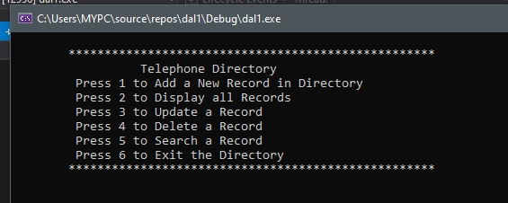
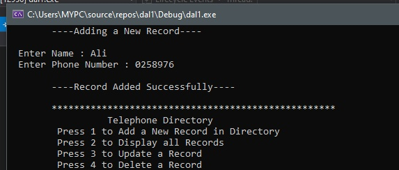
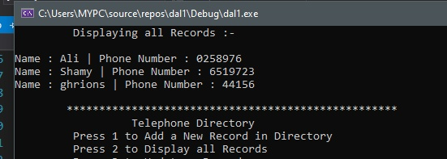
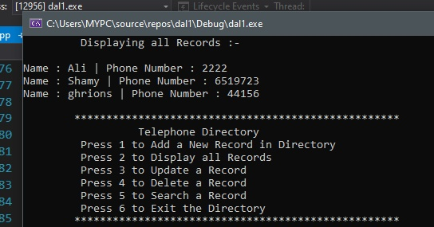
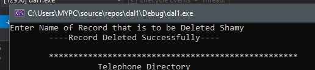
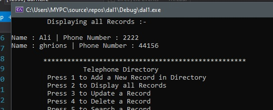
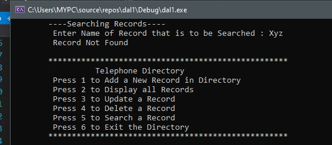
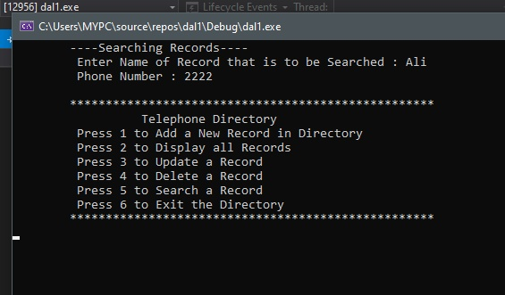

# 📞 Telephone Directory — C++ & Singly Linked List

<div align="center">


A CLI-based **Telephone Directory System** written in **C++** using a custom **Singly Linked List** data structure. Developed as a Data Structures and Algorithms (DSA) project, the system demonstrates basic memory management, node operations, and list traversal for contact storage without standard library containers.

</div>

---

## 📸 Execution Screenshots

<table>
  <tr>
    <td align="center"><br/><b>🏠 Main Menu</b></td>
    <td align="center"><br/><b>➕ Add New Record</b></td>
  </tr>
  <tr>
    <td align="center"><br/><b>📋 Display All Records</b></td>
    <td align="center"><br/><b>🔄 Update Record</b></td>
  </tr>
  <tr>
    <td align="center"><br/><b>🗑️ Delete Record</b></td>
    <td align="center"><br/><b>🔍 Search Record (Found)</b></td>
  </tr>
  <tr>
    <td align="center"><br/><b>🚫 Search Record (Not Found)</b></td>
    <td align="center"><br/><b>🚪 Exit System</b></td>
  </tr>
</table>

---

## ✨ Features

- **Add Contact Record** — Dynamically allocates and inserts a new contact node (Name and Phone Number) at the end of the linked list.
- **Display All Contacts** — Traverses the list from `head` to tail, printing all stored contact cards.
- **Update Contact** — Searches for a contact node by name and updates its phone number.
- **Delete Contact** — Remaps pointers around the targeted node to remove it safely and deletes it from memory (preventing memory leaks).
- **Search Contact** — Fast linear search by name returning the phone number, or displaying `"Record Not Found"` if it doesn't exist.
- **Interactive CLI UI** — Clear console menu with automated screen clearing (`system("cls")`) on choices.

---

## 🧠 Data Structure Mechanics

The system utilizes a custom **Singly Linked List** implementation containing a `head` node pointer:

```
[ Head ] ──→ [ Node 1 ] ──→ [ Node 2 ] ──→ [ Node 3 ] ──→ NULL
             Name: "Anas"   Name: "Ali"    Name: "Hassan"
             Phone: "123"   Phone: "456"   Phone: "789"
```

### Node Structure

```cpp
struct Node {
    string name;
    string phone;
    Node* next;
};
```

### DSA Operations Complexity

| Operation | Implementation Details | Time Complexity | Space Complexity |
|---|---|:---:|:---:|
| **Insertion (Add)** | Iterates to the tail and appends new node | **$O(N)$** | **$O(1)$** |
| **Search** | Linearly traverses looking for `current->name == name` | **$O(N)$** | **$O(1)$** |
| **Update** | Reuses linear search, updates the string value in-place | **$O(N)$** | **$O(1)$** |
| **Deletion** | Remaps predecessor pointer: `pred->next = current->next` | **$O(N)$** | **$O(1)$** |
| **Traversal** | Prints node values sequentially until `current == NULL` | **$O(N)$** | **$O(1)$** |

---

## 📂 Project Structure

```
PHONE_DIRECTORY/
│
├── 📜 main.cpp                — Complete C++ source code
├── 📁 screenshots/            — Visual walkthrough of the CLI interface
│   ├── menu.jpg
│   ├── add_record.jpg
│   ├── display_records.jpg
│   ├── update_record.jpg
│   ├── delete_record.jpg
│   ├── search_record.jpg
│   ├── search_not_found.jpg
│   └── exit_screen.jpg
└── 📦 DSA LAB PROJECT.zip     — Contains original lab reports, proposals, and project docs
```

---

## 🚀 Getting Started

### 1. Clone the Repository

```bash
git clone https://github.com/AnasQ2003/PHONE_DIRECTORY.git
cd PHONE_DIRECTORY
```

### 2. Compile & Run

Using any standard C++ compiler (like `g++`):

```bash
g++ main.cpp -o phone_directory
./phone_directory
```

---

## 📚 Course Context

| Detail | Info |
|---|---|
| **University** | Bahria University, Karachi Campus |
| **Department** | Department of Computer Science |
| **Course** | Data Structures & Algorithms (DSA) Lab |
| **Semester** | 3rd Semester |
| **Project Type** | DSA Lab Project |
| **Key Concepts** | Singly Linked Lists, Node Allocation, Pointers, Memory Deallocation |

---

## 📄 License

```
MIT License

Copyright (c) Phone Directory ---2026 AnasQ2003

Permission is hereby granted, free of charge, to any person obtaining a copy
of this software and associated documentation files (the "Software"), to deal
in the Software without restriction, including without limitation the rights
to use, copy, modify, merge, publish, distribute, sublicense, and/or sell
copies of the Software, and to permit persons to whom the Software is
furnished to do so, subject to the following conditions:

The above copyright notice and this permission notice shall be included in all
copies or substantial portions of the Software.

THE SOFTWARE IS PROVIDED "AS IS", WITHOUT WARRANTY OF ANY KIND, EXPRESS OR
IMPLIED, INCLUDING BUT NOT LIMITED TO THE WARRANTIES OF MERCHANTABILITY,
FITNESS FOR A PARTICULAR PURPOSE AND NONINFRINGEMENT.
```

---

## 👨‍💻 Author

**Anas Ahmed Qureshi.** — [@AnasQ2003](https://github.com/AnasQ2003)

---

<div align="center">
  <p>Built with ❤️ by <strong>Anas</strong></p>
  
 <div align="center">

Made with 🔥 and a lot of ☕

**⭐ If you found this useful, please star the repository!**

</div>
